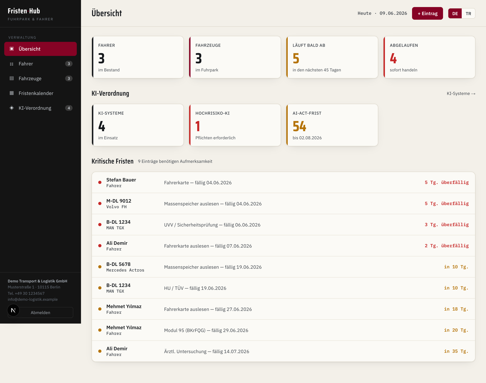
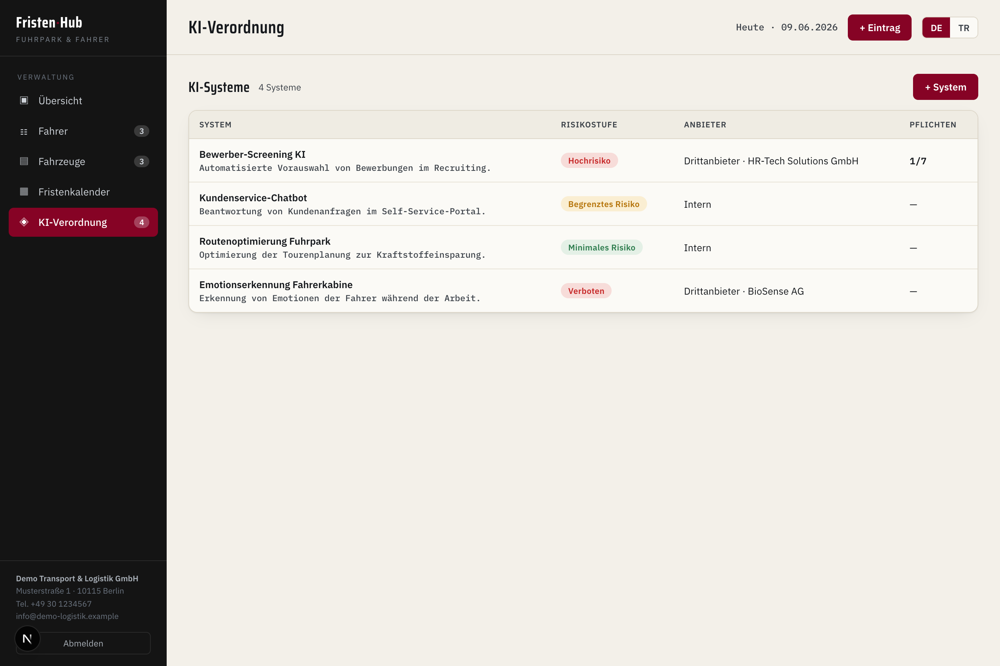
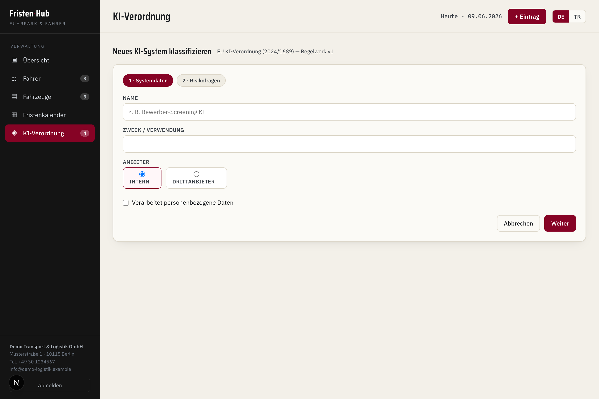
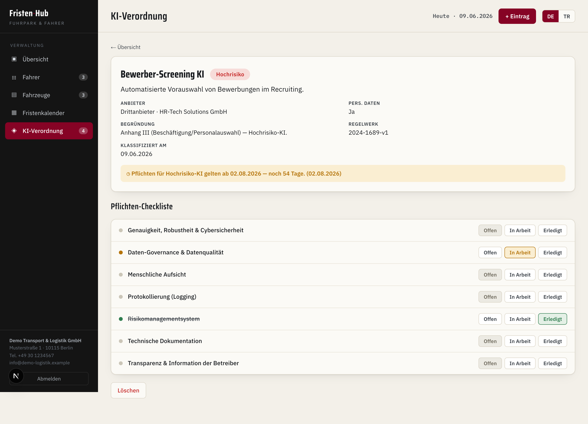

# Fristen-Hub — Fleet & EU AI Act Compliance

Bir nakliye/lojistik şirketi için **vade (Frist) ve uyum takip** uygulaması.
Sürücü/araç belgelerinin son tarihlerini izler ve **EU AI Act (KI-Verordnung)** kapsamında
kullanılan yapay zekâ sistemlerini envantere alıp risk seviyesine göre sınıflandırır.

> İki dilli (🇩🇪 DE / 🇹🇷 TR), bordo temalı, tamamen Server Components + Server Actions mimarisi.

**Stack:** Next.js 16 (App Router, Turbopack) · TypeScript · PostgreSQL · Prisma 7 (`@prisma/adapter-pg`) · `jose` (JWT oturum)

## 📸 Ekran Görüntüleri

| Dashboard — AI Act özet kartı + kritik vadeler | AI sistem listesi — renk kodlu risk rozetleri |
|:--:|:--:|
|  |  |
| **Rehberli sınıflandırma anketi (karar ağacı)** | **Yükümlülük kontrol listesi + son tarih** |
|  |  |

---

## ✨ Öne çıkan modül: EU AI Act uyum takibi

AB Yapay Zekâ Yasası'nın yüksek riskli sistemler için **2 Ağustos 2026** son tarihini
mevcut vade/uyarı altyapısına bağlayan uçtan uca bir modül:

- **AI sistem envanteri** — amaç, sağlayıcı (şirket içi / üçüncü taraf), kişisel veri işleme
- **Rehberli sınıflandırma anketi → karar ağacı** — yasaklı / yüksek / sınırlı / asgari risk
  - Kurallar **koda gömülü değil**; versiyonlanabilir referans veride tutulur
    (`ai_ruleset` / `ai_risk_rule`), `doc_type` deseniyle aynı mantık
- **Yüksek risk → otomatik yükümlülük listesi** (risk yönetimi, veri yönetişimi, teknik
  dokümantasyon, loglama, şeffaflık, insan gözetimi, doğruluk/sağlamlık/siber güvenlik)
- **Yükümlülük kontrol listesi** — durum toggle (açık / devam ediyor / tamamlandı)
- **2026-08-02 son tarihi**, `v_deadlines` görünümüne `UNION` ile eklenerek mevcut
  takvim + kritik liste + KPI + `notification_log` eşik akışına bağlanır — ekstra boru yok
- **Dashboard özet kartı** — kaç AI sistemi, kaçı yüksek riskli, son tarihe kalan gün

## Genel özellikler

- **Vade takibi:** sürücü/araç belgeleri için `doc_type` + `document` esnek modeli
  (yeni belge türü eklemek kod değişikliği gerektirmez)
- **`v_deadlines` görünümü:** tüm vadeleri tek yerde hesaplar
  (`expiry` → `valid_until`; `interval` → `last_action + interval_days`; AI Act → 2026-08-02)
- **Renk kodlu durumlar:** <0g kırmızı, ≤45g sarı, diğeri yeşil
- **Kimlik doğrulama:** bcrypt parola + `jose` ile imzalı HTTP-only JWT çerez

---

## Kurulum

Gereksinimler: **Node.js 20+** ve **Docker** (yerel PostgreSQL için).

```bash
npm install
cp .env.example .env        # AUTH_SECRET / CRON_SECRET için uzun rastgele değerler üret
docker compose up -d        # PostgreSQL 16 (host portu 5433)
npm run db:migrate          # şemayı uygula
npm run db:seed             # örnek veri (sürücü/araç/belge + 4 AI sistemi)
npm run dev                 # http://localhost:3000
```

**Demo girişi:** `admin@example.com` / `demo1234` (`.env` içinden değiştirilebilir).

## Komutlar

| Komut | Açıklama |
|-------|----------|
| `npm run dev` | Geliştirme sunucusu |
| `npm run db:migrate` | `prisma migrate dev` — şema değişikliklerini uygula |
| `npm run db:seed` | Örnek veriyi yükle (`prisma/seed.ts`) |
| `npm run db:studio` | Prisma Studio |
| `npm run lint` | ESLint |

## Veri modeli

`prisma/schema.prisma`:

- **Vade:** `app_user`, `driver`, `vehicle`, `doc_type`, `document`, `notification_log`
- **EU AI Act:** `ai_system`, `ai_classification` (append-only geçmiş), `ai_obligation`,
  ve versiyonlanabilir kural verisi `ai_ruleset` / `ai_risk_rule` / `ai_obligation_template`
- **Görünüm `v_deadlines`:** belge vadeleri + AI Act son tarihini `source` ayraçlı `UNION` ile birleştirir

## Notlar

- Tüm veri demo amaçlıdır; şirket bilgileri ve kimlik bilgileri **örnek/placeholder** değerlerdir.
- Üretimde `.env` içindeki `AUTH_SECRET`, `CRON_SECRET` ve parolalar mutlaka değiştirilmelidir.
- GDPR: üretimde veriler AB'de barındırılmalıdır.

## Lisans

MIT
